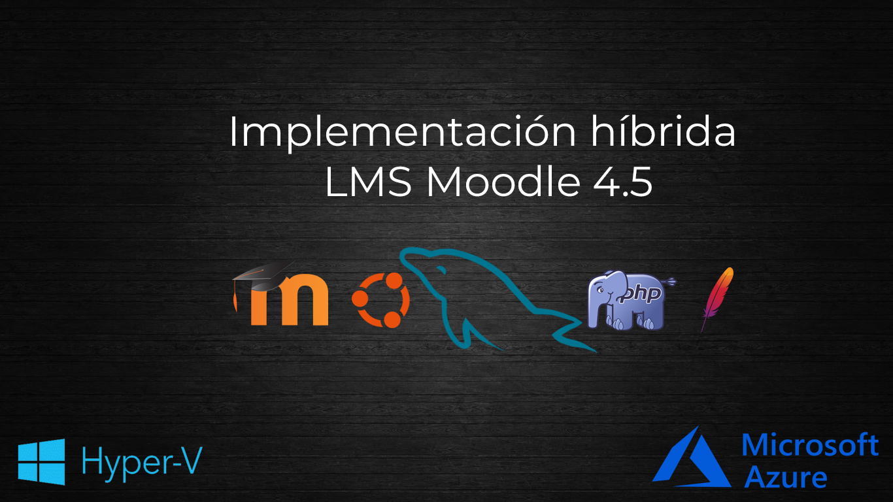

# Implementación híbrida del LMS Moodle 4.5 con Hyper-V y Azure, usando stack LAMP sin servicios PaaS

[](#!)
[](#!)
[](#!)
[](#!)
[](#!)
[](#!)
[](#!)
[](#!)



> Este README documenta, paso a paso, la implementación de Moodle 4.5 tanto en una   VM local con Hyper-V como en una VM de Azure usando el stack LAMP; Linux, Apache, PHP 8.2 y MySQL interno (sin servicios externos de Azure). Incluye comandos reproducibles, verificación, troubleshooting y recomendaciones.

---

## Índice

- [Arquitectura y alcance](#arquitectura-y-alcance)
- [Prerequisitos](#prerequisitos)
- [Despliegue de la vm en azure](#despliegue-de-la-vm-en-azure)
- [Instalación de apache, php 8.2 y extensiones](#instalación-de-apache-php-82-y-extensiones)
- [Instalación y configuración de mysql](#instalación-y-configuración-de-mysql)
- [Descarga y configuración de moodle](#descarga-y-configuración-de-moodle)
- [Validaciones del servidor y ajustes clave](#validaciones-del-servidor-y-ajustes-clave)
- [Troubleshooting](#troubleshooting)
- [Seguridad y HTTPS en AZURE](#seguridad-y-https-en-azure)
- [Implementando DOCKER (En desarrollo)](#implementando-docker-en-desarrollo)
- [Créditos y bibliografía](#créditos-y-bibliografía)

---
## Herramientas usadas

Buena base, Diego 👌. Para enriquecer esa sección y mostrar tu versatilidad, podrías incluir herramientas técnicas, visuales y de documentación que realmente usaste o que complementan tu enfoque autodidacta. Aquí van algunas sugerencias que encajan perfecto con tu proyecto:

---

## Herramientas usadas

- **Hyper-V** – Virtualización local para pruebas y entornos híbridos  
- **Azure Cloud** – Despliegue de VM Ubuntu para entorno Moodle  
- **Photoshop** – Diseño de banners y elementos visuales para documentación    
- **Vim** – Edición de archivos de configuración en Linux  
- **MySQL CLI** – Gestión directa de base de datos Moodle  
- **Apache2** – Servidor web para entorno LAMP  
- **PHP 8.2** – Configuración y validación de extensiones requeridas  
- **Git** – Clonación del repositorio oficial de Moodle  
- **Markdown** – Estructuración del README técnico y visual  
- **Shields.io** – Generación de badges para presentación profesional  
- **phpinfo()** – Validación de entorno PHP desde navegador
- **Visual Studio Code** - Para redacción de documentación en formato Markdown

---

## Arquitectura y alcance

- **Entorno:**  
  VM Ubuntu en Azure, con Apache + PHP 8.2 y MySQL instalados localmente en la misma VM. Sin servicios PaaS externos.

- **Componentes:**  
  - **Apache:** servidor web para Moodle.  
  - **PHP 8.2:** con extensiones requeridas (incluye SOAP).  
  - **MySQL 8.0:** base de datos de Moodle (local).  
  - **Moodle 4.5.8+:** aplicación LMS instalada desde código.

- **Acceso:**  
  - **HTTP:** para laboratorio y validación inicial.  
  - **HTTPS:** recomendado en producción; opcional aquí.

- **Persistencia:**  
  - **Código Moodle:** en `/opt/moodle`.  
  - **Datos Moodle:** en `/var/www/moodledata`.  
  - **DB:** local en `/var/lib/mysql`.

---

## Prerequisitos

- **Cuenta Azure:** acceso para crear VM y abrir puertos.
- **Imagen:** Ubuntu Server LTS (22.04/24.04).
- **Tamaño sugerido:** 2 vCPU, 8 GB RAM, 30–50 GB disco.
- **Puertos en NSG:**  
  - **HTTP (80):** acceso web.  
  - **HTTPS (443):** opcional.  
  - **SSH (22):** administración.
- **Usuario y claves:** acceso sudo en la VM.

---

## Despliegue de la vm en azure

- **Crear VM:**  
  - **Sistema:** Ubuntu Server LTS 24.04.  
  - **Tamaño:** Standard B2as v2 (2 vcpu, 8 GiB de memoria)
  - **Red:** NIC con IP pública estática, NSG abriendo 22/80/443.  
  - **Disco:** LRS de HDD Estándar de 64GB.


- **Post-provisioning (en la VM):**

  ```bash
  sudo apt update && sudo apt -y upgrade
  sudo timedatectl set-timezone America/Santiago
  ```


- **Comprobación de red:**  

  ```bash
  curl -I http://localhost
  ip a
  ```


---

## Instalación de apache, php 8.2 y extensiones

### Hardening básico PHP

```ini
expose_php = Off
display_errors = Off
memory_limit = 256M
```

>No implementado debido a que es un entorno de laboratorio.

### Apache y PHP base

- **Instalar paquetes:**

  ```bash
  sudo apt install -y apache2
  sudo apt update
  sudo apt install -y apache2 libapache2-mod-php8.2 php8.2-cli php8.2-common php8.2-curl php8.2-dom php8.2-gd php8.2-intl php8.2-json php8.2-mbstring php8.2-xml php8.2-zip php8.2-soap

  ```


- **Verificar versiones:**

  ```bash
  php -v
  apache2 -v
  ```


### phpinfo para validar entorno web

- **Crear phpinfo:**

  ```bash
  echo "<?php phpinfo(); ?>" | sudo tee /var/www/html/info.php
  sudo systemctl restart apache2
  ```

- **Acceder:** `http://TU-IP/info.php`  
  Verifica “PHP Version 8.2.x” y “Additional .ini files parsed”.


---

## Instalación y configuración de mysql

>⚠️ Decisión consciente:<br>
 MySQL se despliega en la misma VM para reducir complejidad en laboratorio.
 En producción se recomienda desacoplar DB (Azure Database for MySQL / VM dedicada).

### Instalar MySQL 8.0

- **Paquete:**

  ```bash
  sudo apt install mysql-server mysql-client
  sudo mysql_secure_installation
  ```
  


### Crear base y usuario para Moodle

- **Acceder como root:**

  ```bash
  sudo mysql -u root -p
  ```

- **Crear base y usuario (UTF8MB4):**

  ```sql
  CREATE DATABASE 'nombreDB' DEFAULT CHARACTER SET utf8mb4 COLLATE utf8mb4_unicode_ci;
  CREATE USER 'tuusuario'@'localhost' IDENTIFIED BY 'TuContraseñaAqui';
  GRANT ALL PRIVILEGES ON moodle.* TO 'tuusuario'@'localhost';
  FLUSH PRIVILEGES;
  ```


>⚠️ Por seguridad, los nombres de usuario y contraseñas han sido ocultados. En producción, nunca publiques credenciales reales en capturas ni documentación.

- **Probar acceso con el usuario Moodle:**

  ```bash
  mysql -u tuusuario -p
  ```

  ```sql
  USE nombreDB;
  SHOW TABLES; -- Vacío antes del instalador web (comportamiento esperado)
  ```

---

## Descarga y configuración de moodle

### Descargar Moodle 4.5

- **Paquetes necesarios:**

  ```bash
   cd /opt
   sudo git clone git://git.moodle.org/moodle.git
   cd moodle
   sudo git branch --track MOODLE_405_STABLE origin/MOODLE_405_STABLE
   sudo git checkout MOODLE_405_STABLE
   ```


### Preparar `moodledata` y VirtualHost

- **Crear moodledata, dar permisos seguros y mover al webroot:**

   ```bash
   sudo cp -R /opt/moodle /var/www/html/
   sudo mkdir /var/moodledata
   sudo chown -R www-data /var/moodledata
   sudo chmod -R 0755 /var/www/html/moodle
   ```


- **Acceder al instalador de Moodle via web:** abrir en el navegador `http://IP_PUBLICA_DE_TU_VM/moodle`<br>
  Luego seguir las instrucciones en pantalla: idioma, ruta de datos, ruta de base de datos.

- Usar `/var/moodledata` como directorio de datos.


### Configuración de base de datos en el instalador

>Usar `MySQL mejorado (native/mysql)`

- **Campos:**
  - **Servidor:** `localhost`
  - **Nombre DB:** `nombreDB`
  - **Usuario DB:** `tuusuario`
  - **Contraseña DB:** `TuContraseñaAqui`
  - **Prefijo tablas:** `mdl_` (por defecto)
  - **Puerto:** vacío (usa 3306)


---

## Validaciones del servidor y ajustes clave


>Aquí en este apartado de las comprobaciones del servidor, se muestran los componentes críticos que deben estar instalados para continuar con la siguiente fase. Como se aprecia en la imágen, en `otras comprobaciones`, se muestra que el parámetro de configuración de `max_input_vars` debe quedar en 5000 quedando en estado `revisar`.

### Ajuste de `max_input_vars`

- **Archivo:**

  ```bash
  sudo vim /etc/php/x.x/apache2/php.ini
  ```

>Reemplazar `x.x` con la versión de php que se haya instalado


- **Cambiar valor:**

  ```ini
  max_input_vars = 5000
  ```

>En VIM para abrir la busqueda, presionar la tecla `ESC` para salir del modo `INSERTAR`, luego presionar `/` y escribir el texto

- **Reiniciar Apache:**

  ```bash
  sudo systemctl restart apache2
  ```

---

### Habilitar SOAP y verificar funcionalidad

- **Confirmar carga en web (phpinfo):** ver `20-soap.ini` en “Additional .ini files parsed”.
- **Prueba directa de clases SOAP:**

  ```bash
  echo "<?php var_dump(class_exists('SoapClient')); ?>" | sudo tee /opt/moodle/testsoap.php
  ```

  Accede: `http://TU-IP/testsoap.php` → Debe mostrar `bool(true)`.

### Limpieza de archivos de prueba

- **Eliminar archivos de test:**

  ```bash
  sudo rm /var/www/html/info.php /opt/moodle/testsoap.php
  ```

---

## Troubleshooting

### Errores de VM OnPrem (Con Hyper-V)

### ⚠️ Error de carga de imágen

- Si luego de iniciar la VM, salta el siguiente error:<br>


`Solución`

- Apagar la VM, click derecho sobre la VM -> `Configuración`
- En configuración ir al apartado `Seguridad` y deshabilitar `Arranque seguro`


---

### Como arreglar problemas de internet desde la VM en Hyper-V

Hay un detalle clave en `Hyper-V` y es que si nuestro switch virtual en Hyper‑V está configurado como **“Red interna”**, nuestra VM solo puede comunicarse con el host y otras VMs, pero **no tiene salida a internet**. Para que Ubuntu pueda navegar, necesitamos cambiar la configuración del switch virtual.  

---

### Opciones para dar salida a internet en Hyper‑V

> NOTA: PARA CONEXIONES WIFI REVISAR EL PUNTO 4

1. **Usar un switch virtual externo (recomendado)**
   - Abrimos el *Administrador de Hyper‑V* → *Administrador de conmutadores virtuales*.
   - Creamos un **Conmutador externo** y lo asignamos a nuestra tarjeta de red física.
   - Asociamos ese switch a la VM de Ubuntu.
   - Con esto, la VM recibirá una IP de nuestro router y tendrá acceso directo a internet.

2. **Usar un switch virtual NAT (si no queremos usar externo)**
   - Creamos un **Conmutador interno**.
   - Configuramos en Windows un adaptador NAT para dar salida a internet:

     ```powershell
     New-NetNat -Name "NATNetwork" -InternalIPInterfaceAddressPrefix 192.168.100.0/24
     ```

    > Esto asigna una IP en ese rango a nuestra VM Ubuntu y el host actuará como gateway y permitirá salida a internet.

3. **Verificar en Ubuntu**
    - Una vez configurado el switch correcto, dentro de Ubuntu ejecutamos:

     ```bash
     ip a
     ```

     para ver si tenemos una IP válida.
    - Luego probamos:

     ```bash
     ping -c 4 www.google.com
     ```

    - Si responde, ya tienes conectividad.

4. **Conexiones Wi-Fi**

    Actualmente Hyper-V no tiene soporte con tarjetas de red Wi-Fi (Ej: Desde un notebook).

    Por lo tanto para este propósito existen 2 vías. La primera es usar la conexión que viene por defecto (DefaultSwtch). Pero en el caso de que esta opción no funcione, existe una segunda opción que me ha funcionado:

    Lo que se debe realizar es:

    - En Hyper-V, en el panel lateral derecho -> `Administrador de conmutadores virtuales`

    - Luego: Crear nuevo conmutador virtual interno y darle un nombre.
    - Luego en Windows 10/11 presionar teclas `Windows + R`, luego escribir: `ncpa.cpl`
    - En la ventana de conexiones de RED, botón derecho sobre nuestro adaptador de red Wi-Fi y luego entrar a propiedades.
    - En Propiedades -> Pestaña Uso Compartido
    - `Habilitar:` Permitir que los usuarios de otras redes se conecten a través de la conexión a Internet de este equipo
    - En conexión de red doméstica -> elegir el conmutador virtual interno que se creó en Hyper-v para este propósito.

   ### 📌 Nota importante

    - **Red interna** = solo comunicación entre VMs y host, sin internet.  
    - **Red privada** = solo entre VMs, sin host ni internet.  
    - **Red externa** = acceso completo a internet a través de nuestra tarjeta física.  

    ---

## ⚠️Errores comunes durante instalación / Configuración de Moodle

### 1. Errores con PHP vs Apache

- **Síntoma:** Cambios en `/etc/php/x.x/cli/php.ini` no afectan Moodle.  
- **Verificación:** `phpinfo()` web muestra versión/ini cargado.  
- **Solución:** editar `/etc/php/x.x/apache2/php.ini` y reiniciar Apache.

> 💡 Donde x.x es la versión de PHP

### 2.`phpenmod soap` avisa ini faltante


- **Síntoma:**  

  ```
  WARNING: Module soap ini file doesn't exist under /etc/php/x.x/mods-available
  ```

- **Causa:** falta el archivo `.ini` o no está enlazado al contexto Apache.  
- **Solución:**

  ```bash
  echo "extension=soap" | sudo tee /etc/php/x.x/mods-available/soap.ini
  sudo ln -s /etc/php/8.2/mods-available/soap.ini /etc/php/8.2/apache2/conf.d/20-soap.ini
  sudo systemctl restart apache2
  ```

  Mejor práctica: instalar `phpx.x-soap` para que el paquete cree el `.ini` correcto.

---

## ⚠️Extensión PHP `soap` no desaparece al recargar


**Mensaje:**  
> “Debería estar instalada y activada para conseguir los mejores resultados.”

**Solución:**
Instalar la extensión SOAP con:

```bash
sudo apt install php-soap
sudo systemctl restart apache2
```

> 💡 Esto activa la extensión y reinicia Apache para que Moodle la detecte. Luego de reiniciar el servicio, pinchar el botón de recargar que figura más abajo en la web de Moodle.

---

## ⚠️ No desaparece el mensaje de `max_input_vars` al recargar Moodle


**Mensaje:**  
> “La configuración de PHP max_input_vars debe ser al menos 5000.”

**Solución:**

1. Editar el archivo de configuración de PHP:

   ```bash
   sudo vim /etc/php/x.x/apache2/php.ini
   ```

   *(Reemplazar `x.x` por tu versión de PHP, por ejemplo `8.1`)*

2. Buscar la línea:

   ```ini
   max_input_vars = 1000
   ```

   y cambiar por:

   ```ini
   max_input_vars = 5000
   ```

3. Guardar y reiniciar Apache:

   ```bash
   sudo systemctl restart apache2
   ```

---

## ⚠️ Mensaje: El sitio no usa HTTPS

**Mensaje:**  
> “Se ha detectado que su sitio no se comunica a través de HTTPS.”

**Solución recomendada (opcional en entornos de prueba):**

- Si se está en un entorno de producción, se debería configurar HTTPS con un certificado SSL (por ejemplo, usando Let's Encrypt).
- En entornos de laboratorio o pruebas, se puede ignorar esta advertencia temporalmente.

---

## Complemento a: max_input_vars y extensión SOAP siguen sin desaparecer

## 🔎 Posibles causas

1. **Versión de PHP equivocada**  
   - En Ubuntu se puede tener varias versiones de PHP instaladas (ej. `php8.1`, `php8.2`).  
   - Si se editó el `php.ini` en una versión distinta a la que Apache realmente está usando, los cambios no se aplican.  
   - Verificar con:  

     ```bash
     php -v
     ```

     y revisar qué versión está activa.

2. **Cambios en `php.ini` no aplicados**  
   - Asegurarse de haber guardado y quitado el `;` delante de las líneas que habilitan extensiones.  
   - Luego reiniciar Apache:  

     ```bash
     sudo systemctl restart apache2
     ```

3. **Extensión SOAP no cargada**  
   - Aunque hayamos instalado `php-soap`, puede que no esté habilitada.  
   - Activar con:  

     ```bash
     sudo phpenmod soap
     sudo systemctl restart apache2
     ```

4. **Extensión SOAP sigue inhabilitada**

    En el mismo archivo `php.ini` hay una sección donde se cargan extensiones de PHP.  
    Ahí se debería encontrar algo como:

    ```ini
    ;extension=soap
    ```

    - El `;` al inicio significa que está **comentada** (deshabilitada).  
    - Para habilitarla, simplemente borrar el `;` y dejar:

    ```ini
    extension=soap
    ```

   ## Reiniciar Apache

    Después de guardar los cambios:

    ```bash
    sudo systemctl restart apache2
    ```

    ---

   ## Verificar

    Volver a abrir `http://IP-de-la-vm/info.php` y buscar:

    - En la lista de módulos cargados, debe aparecer `soap`.

    

5. **`max_input_vars` aún no desaparece**  
    - Verificar que el cambio realmente quedó aplicado:  

        ```bash
        php -i | grep max_input_vars
        ```

    - Si sigue en 1000, revisar que se haya cambiado en el archivo correcto (`/etc/php/x.x/apache2/php.ini`).

---

## ✅ Cómo saber qué versión de PHP usa Apache

1. **Verificar la versión activa en CLI (terminal):**

   ```bash
   php -v
   ```

   Esto muestra la versión que se ejecuta al llamar `php` desde la consola.

2. **Verificar la versión que Apache está sirviendo:**
   - Crear un archivo de prueba en el webroot:

     ```bash
     echo "<?php phpinfo(); ?>" | sudo tee /var/www/html/info.php
     ```

   - Abrir en el navegador:

     ```
     http://IP-de-la-vm/info.php
     ```


- Ahí mostrará un panel completo con la versión de PHP que Apache realmente está usando y la ruta exacta del `php.ini` cargado.

>👉 Esto es clave, porque a veces el CLI usa una versión y Apache otra.

3. **Revisar el `php.ini` correcto:**
   - En la salida de `phpinfo()` buscar la línea:

     ```
     Loaded Configuration File => /etc/php/x.x/apache2/php.ini
     ```

   - Ese es el archivo que se debe editar para el parámetro `max_input_vars`.

>🧠 Lección aprendida:<br>
  Siempre validar desde el contexto web (`phpinfo`) y no desde CLI.

---

# Errores en MySQL

## ⚠️Error MySQL 1410 en GRANT

- **Síntoma:**  

  ```
  ERROR 1410 (42000) you are not allowed to create a user with GRANT
  ```

- **Causa:** intentar otorgar privilegios a un usuario no creado (p. ej., `moodledude`).  
- **Solución:** usar el usuario correcto:

  ```sql
  GRANT ALL PRIVILEGES ON moodle.* TO 'moodleadmin'@'localhost';
  FLUSH PRIVILEGES;
  ```

---

## ⚠️ERROR 1819 (HY000) Your password does not satisfy the current policy requirements

Este error aparece cuando la contraseña que se intentó crear durante la configuración de la DB no es lo suficientemente fuerte.

- **Síntoma:**  

  ```
  ERROR 1819 (HY000) Your password does not satisfy the current policy requirements
  ```

- **Causa:** contraseña muy corta Ej: `asd123`
- **Solución:** usar una contraseña mas segura: `TuContraseña1.DB`

>Ejemplo:

  ```sql
  CREATE USER 'tuusuario'@'localhost' IDENTIFIED BY 'TuContraseña1.DB';
  ```

## ⚠️ERROR 1396 (HY000): Operation CREATE USER failed for 'tuusuario'@'localhost'

- **Síntoma:**  

  ```
  ERROR 1396 (HY000): Operation CREATE USER failed for 'tuusuario'@'localhost'
  ```

- **Causa:** Aparece cuando se intenta crear un usuario ya existente por lo que MySQL no permite crear un usuario que ya existe.
- **Solución:** Verificar si el usuario ya existe.

>Ejemplo:

  ```bash
  sudo mysql -u root -p
  ```

Luego:

  ```sql
  SELECT user, host FROM mysql.user;
  ```

## 🧠 ¿Qué hacer si necesitamos modificar el usuario?

Si necesitamos cambiar la contraseña o ajustar algo, puedes usar:

```sql
ALTER USER 'moodleadmin'@'localhost' IDENTIFIED BY 'NuevaContraseñaSegura';
```

Y si por alguna razón quieres eliminarlo y empezar de nuevo:

```sql
DROP USER 'moodleadmin'@'localhost';
```

---

## Error de SQL durante la configuración de Moodle


- **Síntoma:**  

  ```texto
  Warning: mysqli::__construct(): (HY000/1045): Access denied for user 'tuusuario'@'localhost' (using password: YES)
  ```

- **Causa:** Esto significa que Moodle no pudo conectarse a la base de datos porque, a pesar de que el usuario existe, la contraseña que se proporcionó no es correcta.
- **Solución:** Verificar que la contraseña en el campo `Contraseña de base de datos` en la configuración de base de datos en Moodle sea la misma que la que se asignó durante la configuración de MySQL.

---

## Seguridad y HTTPS en AZURE

### ¿Qué significa “Site not HTTPS”?

Moodle detecta que uno está accediendo al sitio por `http://` en lugar de `https://`. Esto implica que:

- La conexión entre el navegador y el servidor **no está cifrada**.
- En entornos de producción, esto puede exponer contraseñas o datos sensibles.
- En laboratorios o entornos de prueba **no es obligatorio**.

---

### 🚧 HTTPS no aplicado por

- ausencia de dominio público en laboratorio
- objetivo centrado en stack LAMP funcional

---

### Habilitar HTTPS con Let’s Encrypt (dominio público)

- **Instalar Certbot para Apache:**

  ```bash
  sudo apt install -y certbot python3-certbot-apache
  ```

- **Solicitar certificado:**

  ```bash
  sudo certbot --apache -d tu-dominio.example.com
  ```

- **Renovación automática:** se instala un cron con `certbot.timer`.

### Alternativas en Azure

- **Proxy inverso y SSL:** Nginx/Traefik/Caddy delante de Apache.  
- **Azure Key Vault:** gestionar certificados y montarlos en la VM.  
- **NSG/WAF:** endurecer acceso público si hay usuarios reales.

⚠️ Esto solo funciona si se tiene un dominio real y acceso desde internet. En redes locales con IP's privadas, no aplica.

---

## Implementando DOCKER (En desarrollo)


---

## Créditos y bibliografía

- **Autor:** Diego Rojas — implementación, pruebas, documentación visual.
- **Fuente de datos:** [**Documentación Moodle**](https://docs.moodle.org/501/en/Main_page)
